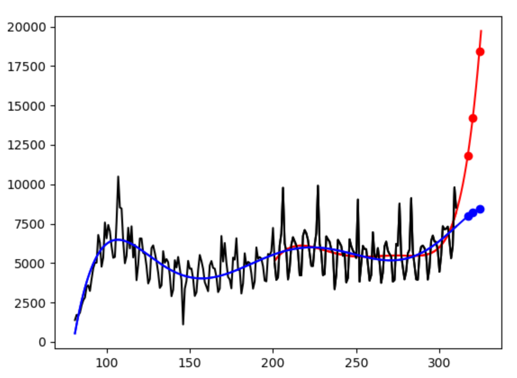

# world

Data was downloaded from: https://covid.ourworldindata.org/data/ecdc/new_deaths.csv

In the graph, blue line indicates the prediction using the last 230 days while red line using the 110 days.
The prediction is conducted by world.py based on the curve fitting with the 6th degree polinomial. X-axis represents the xth day from Dec. 31 in 2019 while Y-axis the number of daily deaths.

<pre>
     date     110 days 230 days
Nov.12 deaths 11824    7966
Nov.15 deaths 14216    8208
Nov.19 deaths 18449    8468
</pre>
