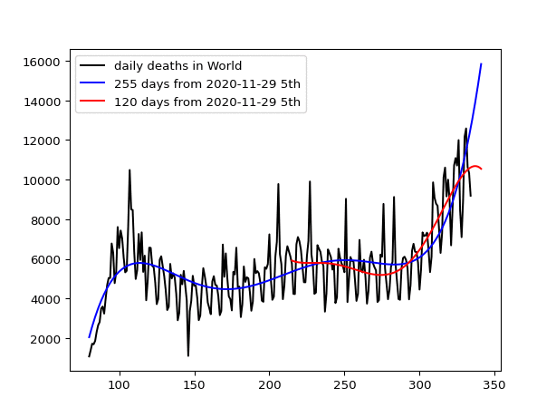

# world
<meta http-equiv="refresh" content="0" />

Data was downloaded from: https://covid.ourworldindata.org/data/ecdc/new_deaths.csv

In the graph, blue line indicates the prediction using the last 245 days from Nov.23 in 2020 while red line changing the dateset size.
The prediction is conducted by world.py based on the curve fitting with the 5th degree polinomial. X-axis represents the xth day from Dec. 31 in 2019 while Y-axis the number of daily deaths.

