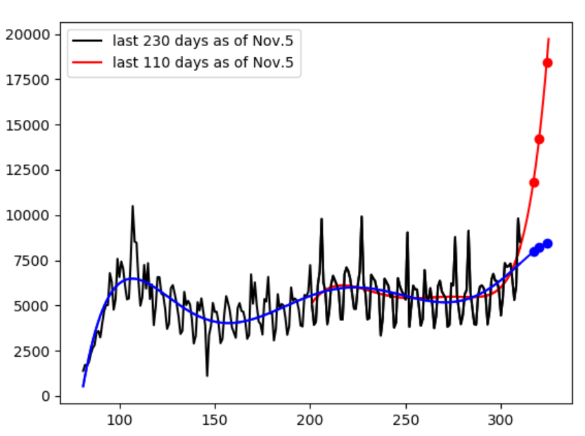

# world

Data was downloaded from: https://covid.ourworldindata.org/data/ecdc/new_deaths.csv

In the graph, blue line indicates the prediction using the last 230 days while red line using the 110 days.
The prediction is based on the curve fitting with the 6th degree polinomial.

